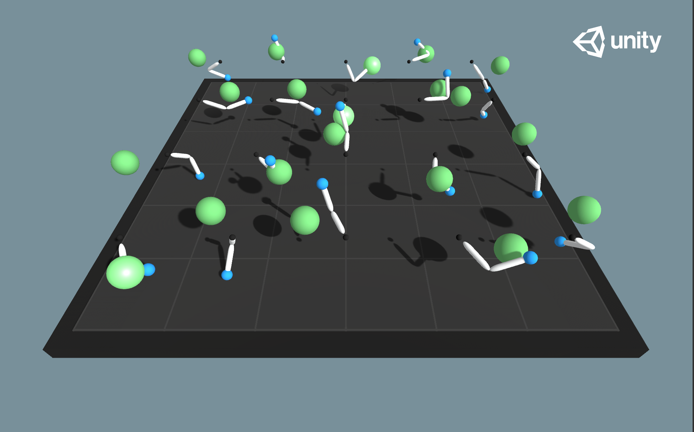

# Continuous-control-Agent

## 1. Project overview : 
A reinforcement learning agent( double-jointed arm) trained to maintain its position toward a target in a continuous environment.

## 2.Task Description :
### 2.1 Environement : 
For this project I am using the [Reacher](https://github.com/Unity-Technologies/ml-agents/blob/master/docs/Learning-Environment-Examples.md#reacher) environment which simulates Double-jointed arm that can move to target locations.

With : 
- the observation has 30 variables about measurements such as velocities , angular velocities .... of the arm .
- The action space is 4 dimentional vector , action = [x1 ,x2, x3, x4] where xi ∈ [-1, +1] with i ∈ {1,2,3,4}
- The rewarding strategy : the agent receives +0.1 if it is in the goal( target) direction and nothing otherwise

Thus the goal is to maintain the position of the arm toward the target for as many time steps as possible.

## 2.2 Solving the environement: 
This taks is considered silved if we reach an average reward of +30.0 over 100 episodes or more.

## 3. Getting started 
If you wish to reproduce this work you need to setup the enviornement by following this section :

### 3.1 Clone this repository :
`
git clone https://github.com/ZSoumia/Continous-control-Agent
`
### 3.2 Set up the environment : 
Please follow instructions from this [repo](https://github.com/udacity/deep-reinforcement-learning#dependencies)

### 3.3 Download the Unity Environment :
Select the Unity environement based on your opertaing system :

- Linux: click [here](https://s3-us-west-1.amazonaws.com/udacity-drlnd/P2/Reacher/one_agent/Reacher_Linux.zip)
- Mac OSX: click [here](https://s3-us-west-1.amazonaws.com/udacity-drlnd/P2/Reacher/one_agent/Reacher.app.zip)
- Windows (32-bit): click [here](https://s3-us-west-1.amazonaws.com/udacity-drlnd/P2/Reacher/one_agent/Reacher_Windows_x86.zip)
- Windows (64-bit): click [here](https://s3-us-west-1.amazonaws.com/udacity-drlnd/P2/Reacher/one_agent/Reacher_Windows_x86_64.zip)

Check out [this](https://support.microsoft.com/en-us/help/827218/how-to-determine-whether-a-computer-is-running-a-32-bit-version-or-64) link if you need help with determining if your computer is running a 32-bit version or 64-bit version of the Windows operating system.

(For AWS) If you'd like to train the agent on AWS (and have not enabled a virtual screen), then please use this [link](https://s3-us-west-1.amazonaws.com/udacity-drlnd/P2/Reacher/one_agent/Reacher_Linux_NoVis.zip) to obtain the "headless" version of the environment. You will not be able to watch the agent without enabling a virtual screen, but you will be able to train the agent. (To watch the agent, you should follow the instructions to enable a virtual screen, and then download the environment for the Linux operating system above.)

==> Place the downloaded file into your cloned project file .

## 4.  Project's structure :

- The Agent.py file contains the general structure of the Reinforcement learning agent .
- The Actor.py contains the actor's network code .
- Critic.py contains the critic's network code.
- Continuous_control.ipynb  is the notebook used to train and evaluate the agent.
-  Continuous control Report.html is a report about the different aspects of this project.
